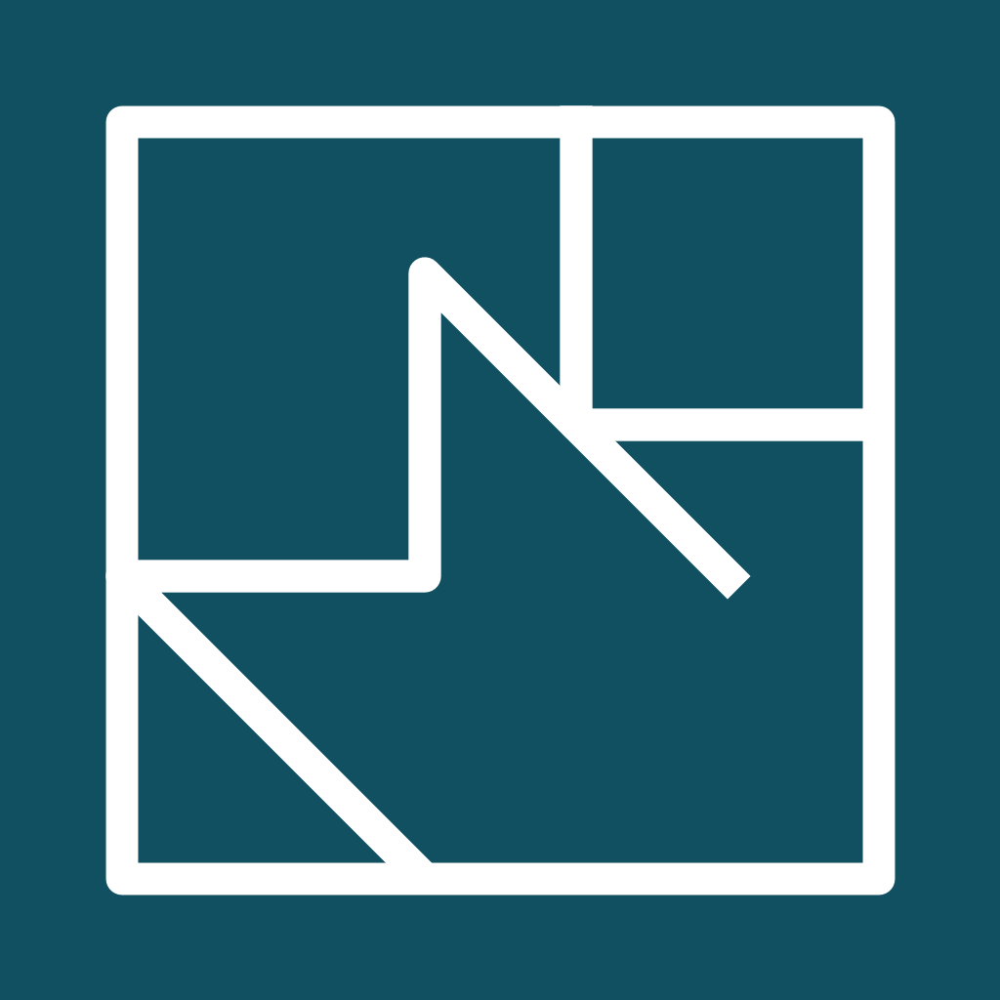

This vault is *another* attempt to document and structure some of [[My Projects|my projects]], [[My Websites|websites]], smaller events and ideas from [[About the blog|blog]] and a general overview of events in my life from [[My Diary|my diary]] plus some experiences in my [[Leisure|leisure time]] into **one** cohesive place. Over time I want to include some [[Travel history|travel stories]]. As of 2026/01/01 this vault has 91 files with a total of 38831 words that would take 2h26 to read.

Here are a few highlights from the 5 categories:
## 1. [[My Projects]]
My life is filled with unfinished projects and new ideas, that I continue to start pursuing. Documenting and organizing these projects, maybe even to finish them, is just another project. On GitHub I started projects in 2018, and by 2020 there were already 35 projects. At the end of 2025 this has grown to more than 170 repositories, with some (like [timeline](https://github.com/kreier/timeline)) having hundreds of commits. 

![[timeline20250925_5.9.jpg]]

As of December 22nd, 2025, only 3 projects are documented in this vault.
## 2. [[My Websites]] 1999-2026
Technically this is another project. Or rather, projects. Over the last 27 years I created and maintained several websites. At the end of 2025 I finally reduced the number to just three, and combined the two private ones into one contract at one provider. Early 2026 I added a Vietnamese one for testing purposes. Now there are only these 4 websites left:

- The *oldest* one: [saiht.de](https://saiht.de) since 1999, my personal page. It started as a playground, diary and private Facebook/Instagram/blog when not even myspace was around for another 4 years. There are a few more details written in this vault at [[saiht.de]] article.
- The *academic* one: [people.physik.hu-berlin.de/~kreier/](https://people.physik.hu-berlin.de/~kreier/) since 2000, it was provided with my study of physics at the **Humboldt Universität von Berlin**, see (to be completed)
- The *professional* one: [kreier.org](https://kreier.org) since 2018, my page for professional things. A few years into being a teacher and switching to the English language, I tried to have some teaching material consolidated there. Earlier, I had also used [[saiht.org]] and [[hofkoh.de]]. More details about this professional site in this vault are written in [[kreier.org]] article.
- The *homelab* one: [hv.io.vn](https://hv.io.vn) I live in the Hưng Vượng 1 apartment complex in Phú Mỹ Hưng, so the hv domain makes sense. The project has some input and output (the io part) and I'm here in Vietnam.

Apart from these 4 websites I had the following domains for some time: More details are listed and linked in the [[My Websites]] page. And for each site I made a separate history page: [[saiht.de]] 1999-2025, kreier.org, people.physik.hu/berlin.de/~kreier/, saiht.org, hofkoh.de, stemfair.org, mypdesign.org, lacy.de, saiht.net (2002-2004).

## 3. [[Travel history]]
It is good from time to time to reflect on the good things one received in life. That is certainly true for journeys to remote places and time with friends. Both the travel itself as time remembering can fill us with gratitude. 
 
Documenting my travels was already a part of my first edition of [[saiht.de]] in 1999. For the trip to Asia in 1998 I bought a book with black pages, since the contrast to the images let them appear more vibrant. A lot has happened since then.
## 4. [[About the blog]]
Not everything is a **project**, or belongs to the **travel** category. But it's worth remembering, to reflect on one's course in life. So I write down some notes about it [in a blog](https://saiht.de/blog).

In 2008 I started a blog with WordPress on blog.saiht.de and managed to write 97 stories until the end of 2025. With Obsidian I copied some stories over, translated them, expanded them and continued to document pieces of my life.
## 5. [[My Diary]]

Several times I started a diary both **physical** on paper and **digital** in many different software solutions and platforms: OneNote, Google Docs, Apple Notes and Journal, Markdown, GitHub, and Websites with plain HTML, some CSS and WordPress. Now little pieces are scattered all around. Here I try to consolidate these all into my Obsidian vault and store it in the Markdown format with GitHub backup. That's my plan in 2025, at least. In a few years I will look back. In November 2025 I have some notes for [[2025]], [[2024]] and [[2023]].

A part of my diary is also the story of [[Leisure]] activities and places I have been [[Working]] and [[Living]].

## Statistics
With several digital places for information, and countless paper documents and other artifacts one might wonder: "How extensive is this project?" Well, I have some answers. More in the [[Obsidian]] article and a [related GitHub](https://kreier.github.io/statistics-diary/) project, written about at [[Statistics of my diary, projects and other stories]].
## History
On November 21st, 2024, I started to use Obsidian to organize and collect my thoughts, while in Phnom Penh, Cambodia. It took until one other visit in October 2025 to get it synced to GitHub and [published on GitHub](https://kreier.github.io/quartz) with Quartz 4.5.2 and on [saiht.de/obsidian](https://saiht.de/obsidian).
## Footnotes
This is a blank Quartz installation. See the [documentation](https://quartz.jzhao.xyz) for how to get started. And one thing I like is the support for LaTeX, like this [Noether](https://en.wikipedia.org/wiki/Noether) current.

$$
j^\mu = \sum_{i=1}^N \frac{\delta\mathcal{L}}{\delta(\partial_\mu\phi_i)}\varphi_i \quad,\quad \varphi_i := \left.\frac{\partial\phi_i}{\partial\alpha}\right|_{\alpha=0}
$$
Of course it fulfils the [Continuity equation](https://en.wikipedia.org/wiki/Continuity_equation). It is taken [from my Wikipedia page](https://de.wikipedia.org/wiki/Benutzer:Saiht/Main) in German, where I contribute since 2006.